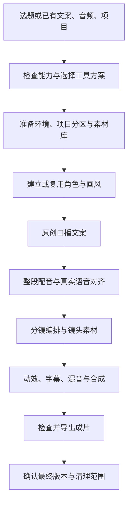

# AI 自动化剪辑｜从选题到成片的 Agent Skill

**给一个选题，AI 自动完成文案、配音、分镜、画面、动效、字幕与导出。**

`ip-video-pipeline` 为个人 IP、知识科普与教程讲解提供完整的制作流程。把它交给能调用工具的 AI Agent，你负责选题和方向，Agent 负责组织素材、执行制作、检查并导出可继续修改的工程。

**面向 Codex、WorkBuddy 等 AI Agent · 支持本地模型与 API · Apache 2.0 开源**

[效果展示](#效果展示) · [快速开始](#快速开始) · [工作原理](#工作原理) · [工具选择](#工具选择) · [详细文档](#详细文档)

## 效果展示

https://github.com/user-attachments/assets/9ad3dfe0-6ba6-4319-bb99-c3f11350b895

**《为什么文件越存越难找？》** — 约 36 秒 / 1080p / 中文配音

从原创狐狸角色与三视图开始，完成口播、整段配音、语音对齐、6 个镜头、知识动效和 15 段字幕。案例使用插画人物镜头与纯旁白，在 Codex 环境完成。

[下载 MP4](https://github.com/Linya-123/ai-auto-video/releases/download/demo-v1/demo.mp4) · [案例附件](https://github.com/Linya-123/ai-auto-video/releases/tag/demo-v1)

## 能帮你做什么？

- **从选题到成片**：串起写稿、配音、分镜、画面生成、动画合成和视频导出。
- **建立可复用的个人 IP**：统一角色、三视图与画风，后续视频沿用已有形象。
- **让画面跟着讲解走**：依据实际语音时间安排镜头、知识图解与字幕。
- **按你的环境选择工具**：复用 Agent 自带能力，也可接本地模型、API 或已有素材。
- **局部修改，接着制作**：保留满意的角色与配音，只改指定镜头；中断后按项目记录续做。
- **素材各归其位**：自动建立共享素材库和单片目录，最终版本及旧文件清理由你确认。

## 快速开始

### 1. 下载并加载 Skill

[下载仓库 ZIP](https://github.com/Linya-123/ai-auto-video/archive/refs/heads/main.zip)，解压后将里面的 **`ip-video-pipeline/` 文件夹**导入所用 Agent 的技能目录。这个文件夹包含 `SKILL.md`、`references/` 和 `scripts/`，需要一起保留。

也可以把下面这段话交给 Agent：

```text
请从 https://github.com/Linya-123/ai-auto-video 获取项目，
将其中的 ip-video-pipeline 文件夹安装到你支持的技能目录。
如果当前环境没有技能安装入口，就读取该文件夹中的 SKILL.md，
并按需读取引用文档、调用随包脚本来执行后续任务。
```

安装完成后，刷新技能列表或开启新会话。Codex 中可用 `$ip-video-pipeline` 调用；WorkBuddy 等环境使用各自的技能入口，或明确要求 Agent 读取该 Skill。

> Agent 需要能读写文件、执行命令，并访问所选生成工具。现有案例在 Codex 验证，其他 Agent 按其工具能力接入。

### 2. 给出你的第一个选题

复制下面的需求，替换方括号即可：

```text
使用 ip-video-pipeline，帮我制作一条约 60 秒的知识视频。

主题：[为什么文件越存越难找]
受众：[经常找不到文件的上班族]
画幅：[横屏 16:9 / 竖屏 9:16]
风格：[原创动物 IP + 简洁知识动效]

先检查当前工具，推荐可行的生图和配音方案，并简要说明优劣。
我选定后，在独立工作区建立素材库和项目分区，补齐必要依赖，
自动完成文案、配音、分镜、画面、动效、字幕和导出。
完成后让我确认采用哪一版，以及哪些旧文件需要清理。
```

### 3. 选择方案，开始制作

Agent 会按你的效果要求、机器条件和预算给出可行方案。选定后准备环境并继续制作，不要求先做一轮音色试听。

| 你的选择 | 需要准备什么 |
|---|---|
| 使用现成音色 | 选择声线与风格 |
| 复刻自己的声音 | 提供自己的参考音频 |
| 使用收费生成服务 | 申请对应 API Key，开通服务并准备额度，按指引在本地配置 |
| 使用本地模型 | 留出模型空间，满足该模型的硬件要求 |
| 复用已有素材 | 告诉 Agent 文件位置，以及哪些版本已经确认 |

首次准备会涉及依赖安装或模型下载；后续视频优先复用现有环境。遇到需要登录、授权或缺少素材的环节，Agent 会指出具体需要你完成的操作。

### 4. 看成片，直接说怎么改

交付包含 **MP4、字幕、可重渲染工程、提示词、素材记录与检查报告**。需要调整时，继续在原项目中说：

```text
继续这个项目：[项目目录]。
保留角色、文案和配音，把第三个镜头改成更直观的对比图，再导出一版。
```

满意后确认最终采用版本。Agent 会列出保留文件、待删旧产物及清理方式，经你确认再清理。

## 工作原理

**Agent 负责编排与调用，脚本负责确定性的处理，生成工具和渲染引擎负责输出素材与成片。** 每个阶段的结果保存到项目中，方便检查、复用与继续修改。



| 组成 | 职责 |
|---|---|
| AI Agent + Skill 文档 | 理解需求、写稿、设计镜头、调用工具、查看结果并修正 |
| 随包 Python 脚本 | 初始化目录、管理素材、调用配音适配器、对齐与切分音频、校验时间轴和成片 |
| 生图 / 配音工具 | 使用当前可用的原生能力、本地模型或 API 生成媒体 |
| HyperFrames + FFmpeg | 制作知识动效、合成声画、编码导出 |

制作文件由 Agent 放入独立工作区，目录自动建立：

```text
video-studio/
├── assets/                 跨视频复用的角色、场景、音乐与模板
├── tools/                  共享依赖环境
└── work/
    └── 日期-选题/
        ├── project.json    项目规格与路径
        ├── STATUS.md       制作进度
        ├── identity/       本片角色参考
        ├── script/         文案
        ├── audio/          配音与对齐结果
        ├── shots/          镜头素材
        ├── composition/    可编辑合成工程
        ├── deliverables/   成片与字幕
        └── reports/        检查报告
```

## 工具选择

基础处理使用 **Python、FFmpeg / FFprobe**；当前合成路线使用 **HyperFrames 与 Node.js 22+**。Agent 会检查实际环境，只安装所选路线缺少的部分。

| 环节 | 可选方案 | 怎么选 |
|---|---|---|
| 图片与角色 | Agent 自带生图 / 图像 API / 已有图片 | 有可用能力就复用；新建 IP 需要能保持参考图一致性的生图工具 |
| 预设声线 | Edge TTS | 接入轻，适合先完成旁白视频；声线与服务可用性受在线服务限制 |
| 本地配音 | Piper | 可本地运行；需要下载模型，语言和表现力取决于声线模型 |
| 云端配音 | MiniMax API | 按服务能力选择声线与表现；需要账户、API Key 和额度 |
| 音色复刻 | Qwen3-TTS / IndexTTS 2 等 | 提供自己的音频；优先复用已有可用脚本，否则按所选版本适配 |
| 已有配音 | 导入录音 | 保留满意的声音，直接进入对齐和剪辑 |

随包配音适配器支持 Edge、Piper、MiniMax 和音频导入；其他路线由 Agent 按实际工具接入。图片生成和 AI 视频生成分开选择，插画加动效的路线不必额外接生视频模型。

## 详细文档

| 想了解什么 | 去哪里看 |
|---|---|
| 完整执行流程 | [Skill 入口](ip-video-pipeline/SKILL.md) |
| 方案优劣与配音接入 | [工具方案](ip-video-pipeline/references/providers.md) |
| 环境安装与素材库 | [工作区初始化](ip-video-pipeline/references/workspace.md) |
| 具体命令与工具调用 | [工具接入](ip-video-pipeline/references/tools.md) |
| 角色一致性与镜头设计 | [视觉编排](ip-video-pipeline/references/visual-prompts.md) |

## 许可证

[Apache License 2.0](LICENSE)。第三方工具、模型与外部素材遵循各自许可。
